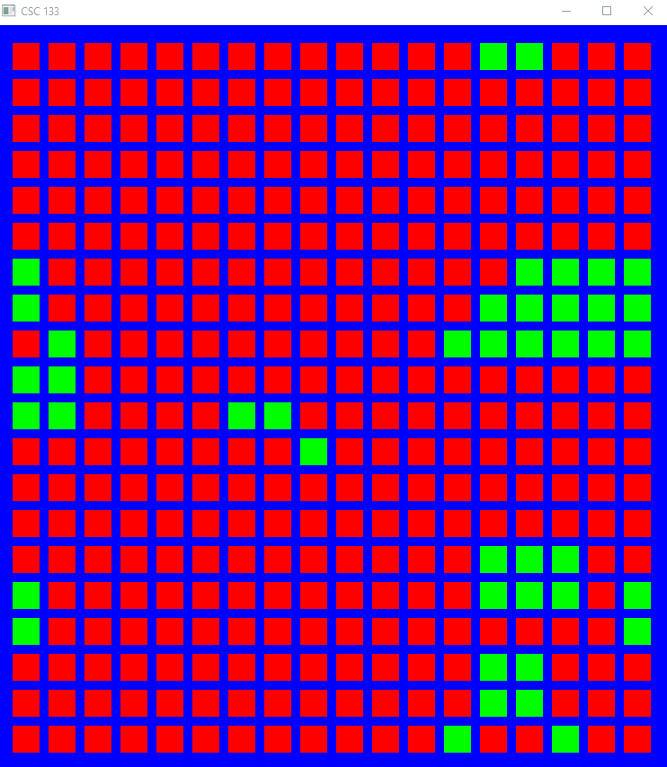

# Game of Life

## Description
This project was part of an assignment for a Computer Graphics and Object-Oriented Programming course I took during Spring 2024. 

It incorporates some of the Game of Life rules and displays dead and alive cells as squares (green = alive, red = dead).
On start-up, the grid is randomized and squares begin rapidly changing depending on the statuses of neighboring squares.

Additionally, the user also has control over slowing down the speed of the game, resetting/randomizing the grid,
saving/loading specific grid configurations, and more with specific key presses.

## Objective
Learn how to draw and render a grid of squares alongside incorporating it with a [back-end system](https://github.com/rahulio96/game-of-life-board)
I previously worked on. Furthermore, I learned how to deal with keyboard presses using poll events and interrupts.

## Stack
Lightweight Java Game Library (lwjgl) and OpenGL.

## Demo
